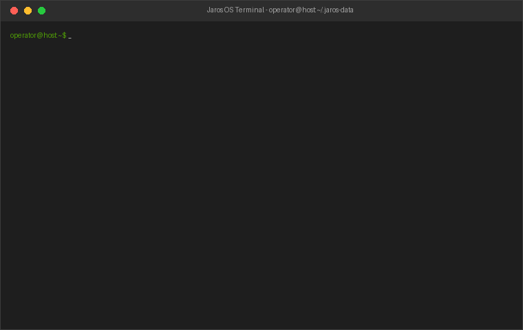
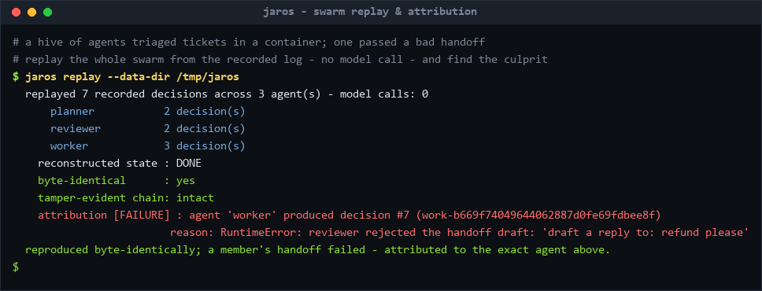
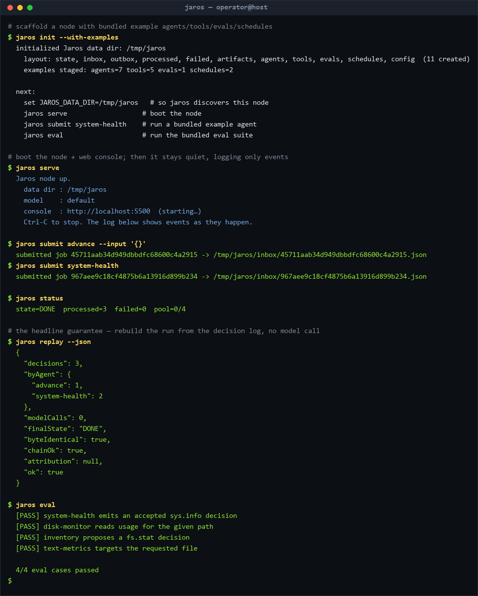

# Jaros

> A zero-infrastructure runtime that makes agent systems **reproducible, testable, and capability-safe by construction** — a durable, replayable state machine that orchestrates AI agents as **lightweight computing threads**, not bloated microservices.



Jaros is the runtime you reach for **the day your agent leaves the demo** — when non-determinism has made it impossible to reproduce, and ambient power has made it unsafe to ship. It delivers that without a server, a database, or a broker: just **files and threads**.

It works by decoupling non-deterministic AI reasoning from deterministic system execution. The LLM is an **interchangeable application** that may only *propose* inert, serializable `Decision` data; a deterministic execution plane decides whether and how each decision runs — and may reject it. This is the system's [Prime Directive](.jarify/PRIME-001/intent.md); every part of the codebase exists to serve it.

---

## What sets Jaros apart

Most agent frameworks let the model drive: a tool call *is* a side effect. Jaros inverts it — the model writes recommendations on slips of paper; a deterministic clerk decides what actually happens. Four properties fall out of that design:

- **🐝 Reproducible & accountable swarms** — every accepted `Decision` is recorded in one ordered, hash-chained log *tagged with its source agent*, so replaying re-executes the **whole hive to byte-identical state with zero model calls** and attributes any failure to the **exact agent and decision**.
- **🔁 Reproducible by replay** — the only non-determinism is the model's output, recorded *before* any effect; replaying the log reconstructs the run to **byte-identical state with no model call**. Crash recovery is just replay.
- **🔒 Capability-safe by construction** — agents hold only the scoped handles the harness grants; a bug or bad decision **cannot reach what it was never given**, and every mediated action is audited.
- **📦 Zero-infrastructure** — no server, no database, no broker. The control plane is the file system; agents are threads in one process. A `check_zero_infra` guardrail fails the build if any code even imports a DB driver or broker.

One command replays a hive and names the culprit — and the agents really **let the model decide** (accept → `DONE`, reject → `FAILED`), yet replay reconstructs whatever the model chose with **zero model calls**:



**→ The full story, with the model-driven decisions, the graduation-layer comparison, and the honest "is / is not": [docs/why-jaros.md](docs/why-jaros.md).**

---

## Quickstart

Install from PyPI and scaffold a ready-to-run node in two commands:

```bash
pip install jaros
jaros init --with-examples   # scaffolds ./.jaros-data with bundled example agents, tools, evals, schedules
```

`jaros init --with-examples` drops a library of example agents and tools straight into the data dir, so the daemon — and the [console](console/) — have something to run immediately. Boot the node, then drive it from another shell; work enters **only** through the shared file system:

```bash
# boot the node (the OS) + the web console — discovers ./.jaros-data by default
jaros serve
#   Jaros node up.
#     data dir : .jaros-data
#     model    : default
#     console  : http://localhost:5500  (starting…)
#     Ctrl-C to stop. The log below shows events as they happen.
```

`jaros serve` brings up the [web console](#web-console) by default (`--no-console` to skip) and stays quiet after the banner — it logs only meaningful events (a job completing or failing, a schedule firing), not a per-tick heartbeat.

```bash
# from another terminal: submit work + watch results, all over the shared FS
jaros submit system-health             # a bundled example agent
jaros submit advance --input '{}'      # the built-in agent
jaros watch                            # change-only: reprints status when it changes, one line per new result
```

Then the payoff — reconstruct the entire run from the recorded decisions, with **no model call**:

```bash
jaros replay
#   replayed 3 recorded decisions (3 applied) - model calls: 0
#     reconstructed state : DONE
#     byte-identical      : yes
#   reproducible: the recorded decisions reconstruct the run exactly, with no model call.
```

The whole loop from the CLI — submit work, check status, replay it byte-identically, and run the eval suite (real output, nothing faked):



Every command discovers the data dir automatically (`./.jaros-data`, or `$JAROS_DATA_DIR`, or `--data-dir DIR` to override). For the full day-one-to-production path (first agent → schedule → eval → replay → console → distributed Docker), see **[docs/getting-started.md](docs/getting-started.md)**.

> Hacking on Jaros itself? Clone the repo and `pip install -e ".[dev]"` instead — every command works the same against a checkout, and `pytest` runs the suite plus the architecture guardrails.

**Want to build your own agents?** Point your coding agent (e.g. **Claude Code**) at **[`agent-kit/`](agent-kit/)**, tell it to read what's there, and it learns the whole system and writes + verifies new Jaros agents for you. See [Build an agent](#build-an-agent).

---

## Web console

A TypeScript + React administrative and monitoring interface lives in **[`console/`](console/)** — submit jobs, install agents and custom tools, watch live status, browse the durable decision log, and **replay it to byte-identical state** from the browser. It's a host-side companion (a thin file-system bridge + SPA); the Jaros node itself stays serverless.

**`jaros serve` starts it for you** and prints the URL — open **http://localhost:5500**. The Overview is a glanceable NOC view with a live get-started checklist; every other page (State Machine, Reproducibility, Harness, Jobs, Agents, Schedules, Evaluations) introspects the *real* runtime over the file system.


Want it on its own (first run, or pointed at a remote node's shared dir)? Install its deps once and run it standalone:

```bash
cd console && npm install
JAROS_DATA_DIR=/tmp/jaros-demo npm run dev        # then open http://localhost:5500
```

The full page gallery and a walkthrough of every page (with pictures) live in **[docs/console.md](docs/console.md)** and the [console README](console/README.md#screenshots).

---

## Build an agent

An agent is a `ReasoningBoundary`: **data in → `Decision` data out**, no side effects, no handles. Drop the module into the shared-FS `agents/` folder and the daemon registers it at runtime.

```python
import uuid
from jaros.core import create_decision

KIND = "greeter"  # the agent kind the daemon registers

class GreeterBoundary:
    def __init__(self, llm):
        self._llm = llm

    def decide(self, context) -> list:
        name = context.get("name", "world") if isinstance(context, dict) else "world"
        # Propose an inert decision; the executor (not the agent) acts on it.
        return [create_decision(
            id=f"greet-{uuid.uuid4().hex}",
            source="greeter",
            kind="advance",                       # built-in handler drives the state machine
            payload={"events": ["start", "complete"], "note": f"hello {name}"},
        )]

def build(llm):                                   # agent factory the daemon calls
    return GreeterBoundary(llm)
```

To bound an agent, restrict its capability grant at spawn time — a *role* is just a named bundle of capabilities. A *custom tool* extends what the system can *do*: drop a class exposing `NAME`, `validate()`, and `execute()` into `tools/`. See **[`examples/tools/greet_tool.py`](examples/tools/greet_tool.py)** and the full guide in **[docs/building-agents.md](docs/building-agents.md)**.

**Or let a coding agent build it.** Jaros is made to be extended *by* coding agents. Point yours — **Claude Code**, Cursor, or similar — at **[`AGENTS.md`](AGENTS.md)** → **[`agent-kit/`](agent-kit/)** and have it read what's there: the mental model, a skill per artifact, accurate API reference, and runnable templates that pass `jaros eval` unmodified. Tell it *"read `agent-kit/` and build me an agent that does X,"* and it will.

---

## Run on Docker

The container is the boundary for the **whole Jaros node**; agents run as threads *inside* it — never one container per agent.

```bash
docker build -t jaros .
docker run -d --name jaros_os -v ${PWD}/.jaros-data:/data jaros   # one daemon = one node
jaros submit advance --input '{}'                                 # submit from the host, over the shared FS
```

Because the control plane is files only, scheduling needs no broker: any host-side cron can `jaros submit`, and several daemons can share one directory — each job is claimed by an atomic `inbox → claimed` rename (exactly-once in the happy path, at-least-once under failure via lease reclaim). The distributed walkthrough is in **[docs/getting-started.md](docs/getting-started.md#9-deploy-in-docker-one-node-then-many)**.

---

## Learn more

- **[docs/getting-started.md](docs/getting-started.md)** — the full day-one path, first agent → distributed Docker.
- **[docs/why-jaros.md](docs/why-jaros.md)** — what sets Jaros apart, in depth, plus where it fits and what it is *not*.
- **[docs/architecture.md](docs/architecture.md)** — the two planes, the guardrails, the subsystem map, and the project layout.
- **[docs/building-agents.md](docs/building-agents.md)** — write agents and custom tools by hand.
- **[docs/console.md](docs/console.md)** — a visual guide to every console page.
- **[`agent-kit/`](agent-kit/)** — hand it to your coding agent to build Jaros agents the way you'd use them.
- **[`.jarify/PRIME-001/intent.md`](.jarify/PRIME-001/intent.md)** — the Prime Directive every part of the system serves.

Jaros is developed spec-first under `.jarify/`: the Prime Directive holds the system intent, each `EXT-00x` spec decomposes one tenet into requirements/design/tasks, and code is traced back to requirements via `index.json`.
