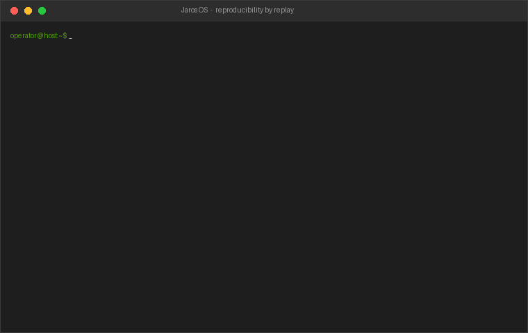
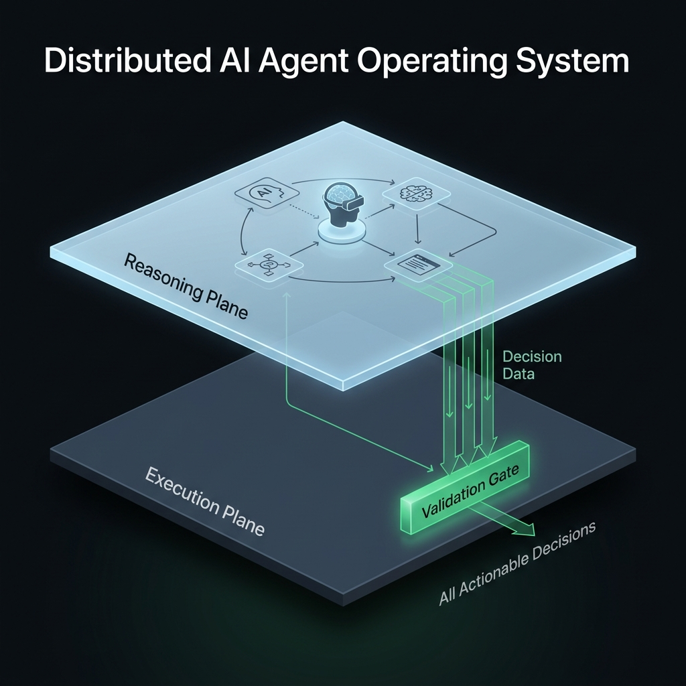

# Jaros

> A zero-infrastructure runtime that makes agent systems **reproducible, testable, and capability-safe by construction** — a durable, replayable state machine that orchestrates AI agents as **lightweight computing threads**, not bloated microservices.


Jaros is the runtime you reach for **the day your agent leaves the demo** — when non-determinism has made it impossible to reproduce, and ambient power has made it unsafe to ship. It delivers that without a server, a database, or a broker: just **files and threads**.

It works by decoupling non-deterministic AI reasoning from deterministic system execution. The LLM is an **interchangeable application** that may only *propose* inert, serializable `Decision` data; a deterministic execution plane decides whether and how each decision runs — and may reject it. This is the system's [Prime Directive](.jarify/PRIME-001/intent.md); every part of the codebase exists to serve it.

---

## What sets Jaros apart

Most agent frameworks let the model drive: a tool call *is* a side effect. That's fine for a demo and a liability in production. Jaros inverts it — the model writes recommendations on slips of paper; a deterministic clerk decides what actually happens. Two properties fall out of that design, and they're the whole point:

### 🔁 Reproducible by replay

The only non-determinism in a run is the model's output, captured as inert `Decision` data and recorded to a durable log **before** any effect is observable. Replaying that log through the deterministic executor reconstructs the run to **byte-identical state — with no model call.** Crash recovery is just a special case of replay.

That means a misbehaving agent run is debuggable like any other software: **pin the decision log, replay, reproduce, fix, re-run identically.** No "it only happens sometimes."



In the [web console](console/) it's one click — browse the durable decision log and replay it, with the reconstructed state, the model-call count, and a byte-identical check shown inline:


### 🔒 Capability-safe by construction

Agents hold only the scoped handles the harness grants them — no ambient access to the file system, queues, or network. A bug or a bad decision **cannot reach what it was never given**, and every mediated action leaves an auditable record. This is structural least-privilege for blast-radius control (host-level isolation against hostile code stays the host's job — process, container, VPC).

The console makes that legible — the mediation rules, the role→capability bundles, and the refusal/failure audit, all in one view:


### 📦 Zero-infrastructure

No server, no database, no broker. The whole control plane is the local/shared file system; agents are threads in one process. It runs anywhere files work, and a `check_zero_infra` guardrail fails the build if any code so much as imports a database driver or message broker.

### 🎓 The graduation layer

Jaros sits between a prototype (LangGraph, CrewAI) and heavyweight durable-execution infrastructure (Temporal, Dapr):

| | Prototype frameworks | **Jaros** | Durable-execution infra |
| --- | --- | --- | --- |
| Stand-up cost | none | **none** — files + threads | servers, brokers, databases |
| Reproducibility | best-effort | **record-and-replay to byte-identical state** | workflow replay (heavy) |
| Safety model | ambient tool access | **capability-scoped, default-deny** | varies |
| Model coupling | often hard-wired | **one interface, config swap** | varies |
| Distribution | single process | **single-node-first, bounded multi-node over the FS** | cluster-scale |
| Reach for it… | the first ten lines | **the day you ship** | large orgs at cluster scale |

It is deliberately **not**: a hardened security sandbox, a cluster-scale distributed system, an agent-authorization/governance gateway, a hello-world prototyping framework, or "unbreakable." It claims only what the architecture delivers — durable, crash-recoverable, replayable, and capability-bounded. (See the [Prime Directive](.jarify/PRIME-001/intent.md) for the full "is / is not.")

---

## Why agent builders use it

- **Ship runs you can reproduce.** The decision log turns a flaky prod incident into a deterministic replay you can step through.
- **Contain the blast radius.** Least-privilege handles mean a misbehaving agent touches only what you granted it — and you can audit every action.
- **Stand up nothing.** No infra to provision; `pip install` and run, or one Docker container per node.
- **Swap models freely.** The LLM lives behind one `LlmClient` interface; change provider/model by config, with zero harness changes.
- **Extend at runtime.** Drop a plugin agent into `plugins/` or a custom tool into `tools/` and the daemon loads it on the next tick — no restart, no core edits.

---

## Quickstart

```bash
pip install -e ".[dev]"
```

Stand up the OS on a data directory, then drive it from another shell — work enters **only** through the shared file system:

```bash
# stage the example agents into the shared volume (see examples/)
mkdir -p .jaros-data/plugins .jaros-data/tools
cp examples/plugins/*.py .jaros-data/plugins/
cp examples/tools/*.py   .jaros-data/tools/

# boot the long-running daemon (the OS)
jaros serve --data-dir .jaros-data
```

```bash
# from another terminal: submit work + watch results, all over the shared FS
jaros submit advance --input '{}'                  --data-dir .jaros-data
jaros submit echo    --input '{"msg": "hello"}'    --data-dir .jaros-data
jaros submit greeter --input '{"name": "Jaros"}'   --data-dir .jaros-data
jaros watch  --data-dir .jaros-data
```

Each accepted decision is recorded to `.jaros-data/state/decisions.log`, so the whole run is reproducible by replay. See **[`examples/`](examples/)** for the agents used above, and run the end-to-end smoke tests:

```bash
python tests/integration/run_local_demo.py       # local stand-up (no Docker)
python tests/integration/run_container_demo.py    # full Docker container run
```

---

## Web console

A TypeScript + React administrative and monitoring interface for a running Jaros
OS lives in **[`console/`](console/)** — submit jobs, install plugin agents and
custom tools, watch live status, browse the durable decision log, and **replay
it to byte-identical state** from the browser. It's a host-side companion (a thin
file-system bridge + SPA); the Jaros node itself stays serverless.

The **Overview** is a glanceable NOC view — live machine state, throughput, the agent pool, and the no-server/database/broker profile, all streamed over the file system:


It reflects the *real* runtime, not a hard-coded copy: the **State Machine** view introspects the model straight from `jaros` and renders the live durable transition log beside it.


```bash
cd console && npm install
JAROS_DATA_DIR=/tmp/jaros-demo npm run dev        # then open http://localhost:5500
```

The full page gallery (Jobs, Agents & Tools, and more) lives in the [console README](console/README.md#screenshots).

---

## How it works



Jaros is split into two planes that never merge:

- **Reasoning Plane** (non-deterministic): agents think and propose `Decision` data. The LLM lives here as a pluggable application.
- **Execution Plane** (deterministic): the durable, replayable state machine and its harness validate and execute decisions, persist them, and route all communication.

The only channels between an agent and the rest of the system are **rigid queues** and the **shared file system**. There are no direct agent-to-agent calls.

### The LLM decides *what*, not *how*

A frequent misreading is "the LLM can't make decisions." It can — that *is* the reasoning. The precise rule is:

> **The LLM decides WHAT to propose. The deterministic system decides HOW — and whether — it runs.**

An agent's reasoning may only emit an inert, serializable `Decision`. A deterministic validation gate stands between that data and any action; the executor — never the model — drives execution.

```text
  typical agent:   LLM ── tool call ──► side effect happens   (LLM drives execution)

  jaros:           LLM ── Decision (data) ──► [gate] ──► executor   (executor drives execution)
                                                 │
                                                 └─► may REJECT; LLM has no say
```

Because the model holds no control, recording its outputs and replaying them through the executor reproduces the run exactly — and the model itself is swappable with zero harness changes.

---

## Build an agent

An agent is a `ReasoningBoundary`: **data in → `Decision` data out**, no side effects, no handles. Drop the module into the shared-FS `plugins/` folder and the daemon registers it at runtime.

```python
import uuid
from jaros.core import create_decision

KIND = "greeter"  # the agent kind the daemon registers

class GreeterBoundary:
    def __init__(self, llm):
        self._llm = llm

    def decide(self, context) -> list:
        name = context.get("name", "world") if isinstance(context, dict) else "world"
        # Propose an inert decision; the executor (not the agent) acts on it.
        return [create_decision(
            id=f"greet-{uuid.uuid4().hex}",
            source="greeter",
            kind="advance",                       # built-in handler drives the state machine
            payload={"events": ["start", "complete"], "note": f"hello {name}"},
        )]

def build(llm):                                   # plugin factory the daemon calls
    return GreeterBoundary(llm)
```

To bound an agent, restrict its capability grant at spawn time — a *role* is just a named bundle of capabilities:

```python
from jaros.harness.capabilities import GrantSpec

# Grant ONLY file-write inside the layout; the agent can reach nothing else.
ctx = harness.spawn("greeter", GrantSpec(role="FsWriteRole", fs=shared_fs))
```

A *custom tool* extends what the system can *do*: drop a class exposing `NAME`, `validate()`, and `execute()` into `tools/`, and an agent proposes a decision of that `kind`. See **[`examples/tools/greet_tool.py`](examples/tools/greet_tool.py)** and the full guide in **[docs/building-agents.md](docs/building-agents.md)**.

---

## Run on Docker

The container is the boundary for the **whole Jaros node**; agents run as threads *inside* it — never one container per agent.

```bash
docker build -t jaros .

# one long-running daemon = one node; work arrives over the mounted volume
docker run -d --name jaros_os -v ${PWD}/.jaros-data:/data jaros

# submit from the host, purely over the shared FS
jaros submit advance --input '{}' --data-dir .jaros-data
```

### Scheduling across containers (single-node-first)

Because the control plane is files only, scheduling is decoupled and needs no broker:

- **Host-side cron** — any scheduler (`cron`, Kubernetes `CronJob`, Task Scheduler) can `jaros submit`.
- **Multi-container ingest** — run several daemons on the same shared dir; they coordinate over the file system. Each job is claimed by an atomic `inbox/<id>.json → claimed/<id>.json` rename, so exactly one node processes it and siblings skip it (bounded multi-node, no consensus service). A crashed node's in-flight claim is reclaimed to the inbox on the next boot.

---

## Architecture guardrails

Structural constraints are enforced by automated checks (run with `pytest`), so the design can't silently rot:

| Check | Enforces |
| --- | --- |
| `scripts/check_planes.py` | No Execution-Plane module imports reasoning/LLM code |
| `scripts/check_no_server.py` | No agent/runtime code opens a listening socket or HTTP server |
| `scripts/check_comms.py` | No direct agent-to-agent reference, RPC, or network call |
| `scripts/check_zero_infra.py` | No import of a database driver, message broker, or external server framework |

---

## Subsystems

| Subsystem | Spec | What it owns |
| --- | --- | --- |
| Reasoning / Execution Boundary | [EXT-001](.jarify/EXT-001/requirements.md) | Inert `Decision` contract, reasoning boundary, validation gate, executor |
| Durable, Replayable State Machine | [EXT-002](.jarify/EXT-002/requirements.md) | Explicit transitions, durable decision log, deterministic replay, crash recovery, bounded multi-node coordination |
| Agent Thread Runtime | [EXT-003](.jarify/EXT-003/requirements.md) | Cheap agent lifecycle, bounded pool, fault containment |
| Interchangeable LLM Adapter | [EXT-004](.jarify/EXT-004/requirements.md) | Single `LlmClient` interface, pluggable adapters, config-only swap |
| Architectural Harness | [EXT-005](.jarify/EXT-005/requirements.md) | Mediated actions, default-deny rules, capability-scoped handles |
| Communication Fabric | [EXT-006](.jarify/EXT-006/requirements.md) | Rigid typed queues, shared FS layout, exclusivity enforcement |
| Runtime Daemon (OS Boot) | [EXT-007](.jarify/EXT-007/requirements.md) | Boot, file monitoring, atomic inbox ingestion, zero-infra boot |
| Host Control CLI | [EXT-008](.jarify/EXT-008/requirements.md) | Command-line management, atomic job submission, plugin installer |
| Dynamic Custom Tools | [EXT-009](.jarify/EXT-009/requirements.md) | Runtime-loaded namespaced tools (`NAME`/`validate`/`execute`) |
| Admin & Monitoring Console | [EXT-010](.jarify/EXT-010/requirements.md) | Host-side TypeScript + React console: monitor, submit, install, replay |
| Native Agent Scheduling | [EXT-011](.jarify/EXT-011/requirements.md) | File-based cron + interval + one-shot scheduling, crash-safe, no external cron |
| Read-Only Agent Library | [EXT-012](.jarify/EXT-012/requirements.md) | Many drop-in read-only agents + tools (health, disk, inventory, text) — run concurrently |
| Agent Evaluation Framework | [EXT-013](.jarify/EXT-013/requirements.md) | Reproducible, declarative agent evals (`jaros eval`) — input → expected decision/result |

The full system-wide design lives in [`.jarify/PRIME-001/design.md`](.jarify/PRIME-001/design.md).

---

## Project layout

```text
jaros/
  core/        EXT-001  Decision, ReasoningBoundary, validation gate
  execution/   EXT-001  deterministic executor + pluggable handlers; custom tools (EXT-009)
  state/       EXT-002  model, machine, durable transition log, decision log + replay, recover, coordination
  runtime/     EXT-003  AgentThread, AgentPool (lightweight threads)
  llm/         EXT-004  LlmClient interface + pluggable adapters + factory
  harness/     EXT-005  capabilities, rules, Harness (mediates all I/O)
  comms/       EXT-006  Queue, SharedFileSystem
  registry.py  EXT-007  agent registration + plugin loading
  daemon.py    EXT-007  runtime daemon (the OS boot engine)
  cli.py       EXT-008  Host Control CLI
examples/               drop-in example plugin agents + a custom tool
scripts/                architecture checks (planes / no-server / comms / zero-infra)
tests/                  unit + integration test suites
.jarify/                Jarify specifications (the source of intent)
```

---

## Specification-driven with Jarify

Jaros is developed spec-first under `.jarify/`. The Prime Directive (`PRIME-001`) holds the system intent; each feature spec (`EXT-00x`) decomposes one tenet into requirements, design, and tasks, with code traced back to requirements via `index.json`. The directive is the target: where the code lags it, the code changes — not the directive.
