# The Jaros Console — a visual guide

The console is a host-side window onto a running Jaros node: a thin file-system
bridge plus a React SPA. It drives **everything** the node can do — submit jobs,
install agents and tools, manage schedules, run evals, browse and replay the
decision log, and introspect the state machine and harness — all over the shared
file system. The node itself stays serverless.

**The console ships in the wheel — no Node required.** `pip install jaros`
bundles a prebuilt SPA and a pure-stdlib server, so **`jaros serve` brings the
console up by default** — boot a node and open **http://localhost:5500**. Run it
standalone with `jaros console`, choose the port with `--console-port`, or skip
it with `jaros serve --no-console`:

```bash
jaros serve                          # node + console
jaros console                        # just the console, against the discovered data dir
jaros console --console-port 8080    # …on a port you pick
```

> Point `$JAROS_DATA_DIR` (or `--data-dir`) at the same data dir a `jaros serve`
> daemon is using. Use a throwaway dir for experiments — never one another daemon owns.

### Developing the console

The bundled server is the Python twin of the TypeScript bridge under `console/`.
For React hot-reload while hacking on the UI, run the TS dev server against a
checkout (and re-bundle with `python scripts/sync_console_dist.py` when done):

```bash
cd console && npm install
JAROS_DATA_DIR=/tmp/jaros npm run dev        # open http://localhost:5500
```

## Finding your way around

The console is built to be self-explanatory:

- **First-run tour** — the first time you open it, a brief four-step wizard walks
  you through the core loop. Re-open it anytime with the **? Guide** button in the
  top bar.
- **Get-started checklist** — the Overview shows a live checklist that lights up
  each step as you complete it, so you always know what to do next.
- **Page intros & tooltips** — every page has a one-line "what this is for" banner
  with a **Learn more →** link into the in-app guide, and key controls have hover
  tooltips.
- **Help & Docs** — an in-app page (this guide, with pictures) plus a
  copy-pasteable CLI quickstart, reachable from the sidebar.

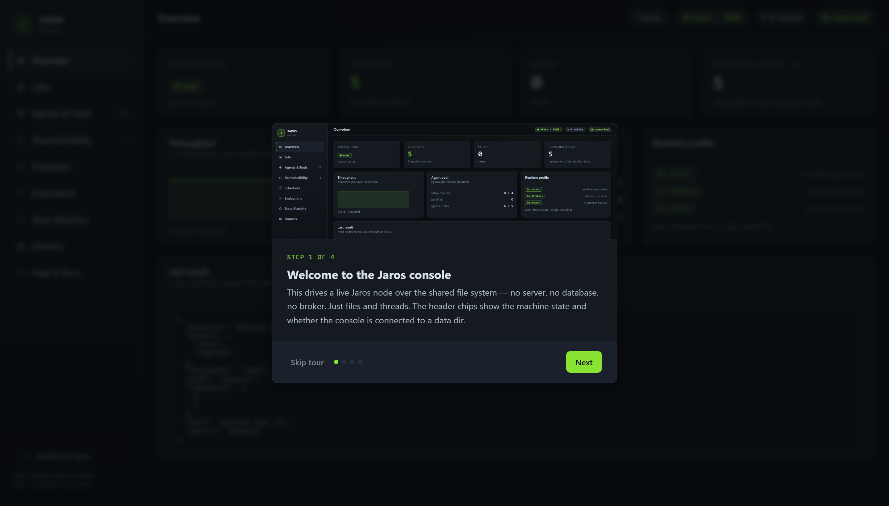

The Overview greets a new operator with a live checklist — each step lights up as
it's completed, and the current step is highlighted with a direct link:

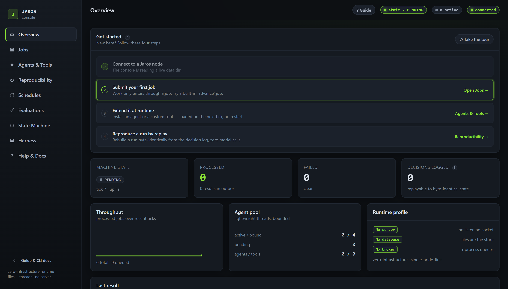

Every screen documents itself: a one-line intro with a **Learn more →** link, and
hover tooltips on key controls.

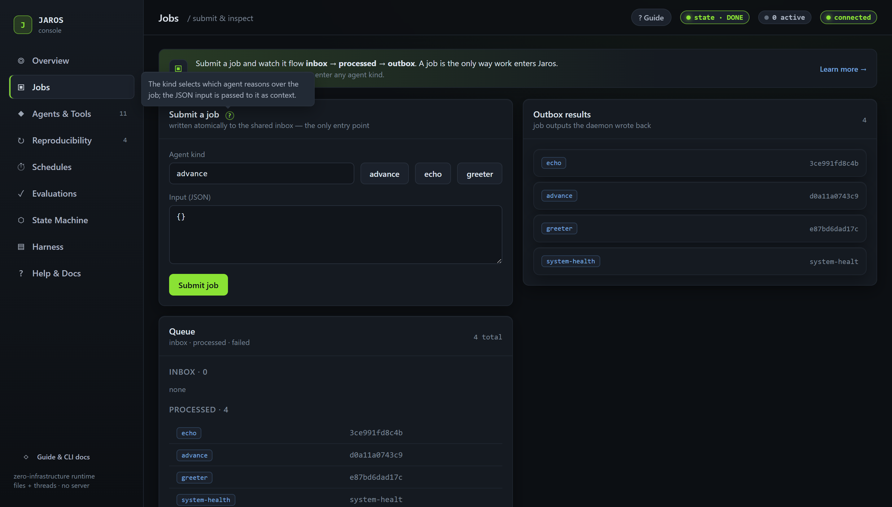

The in-app **Help & Docs** page collects all of this — every page with pictures
plus a copy-pasteable CLI quickstart:

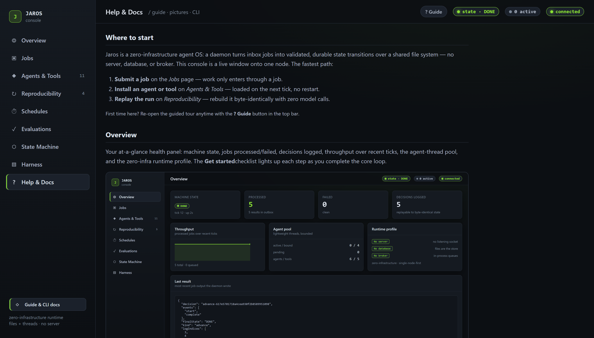

## Overview

Your at-a-glance health panel: machine state, jobs processed/failed, decisions
logged, throughput over recent ticks, the agent-thread pool, and the zero-infra
runtime profile. New operators also see the get-started checklist here.

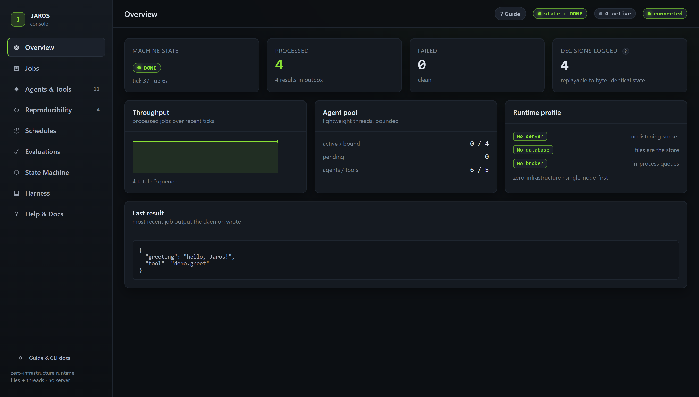

## Jobs

Submit a job (an agent `name` + JSON input); it is written atomically to the
shared `inbox/` — the only way work enters Jaros. Watch it flow
inbox → processed → outbox. Preset buttons give a one-click start.

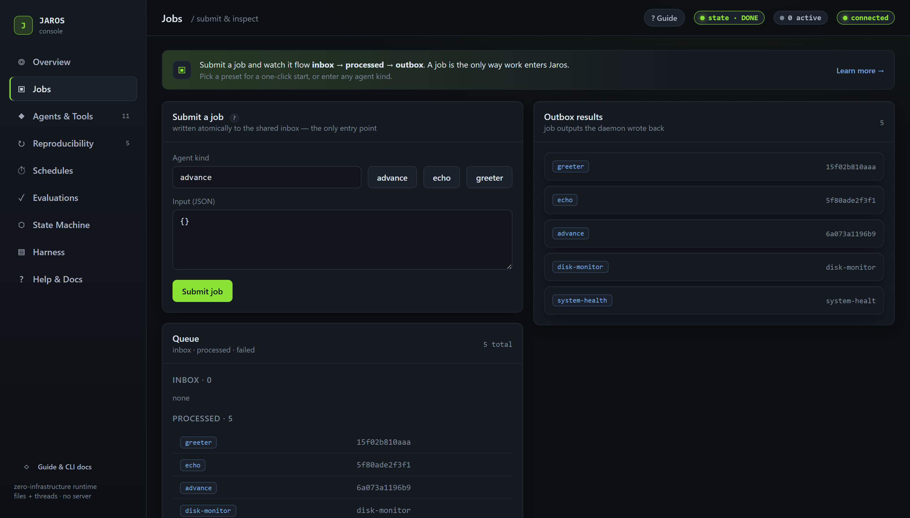

```bash
jaros submit advance --input '{}'
jaros status
```

## Agents & Tools

Lists the agents loaded from `agents/` and the custom tools from `tools/`.
Install a new one by name + Python source and the daemon picks it up on the next
tick — no restart. An **agent** proposes inert `Decision` data; a **tool**
executes a namespaced action.

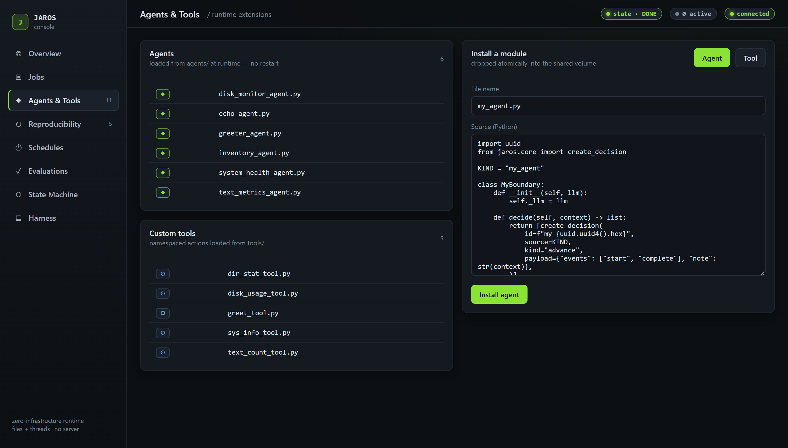

```bash
jaros add-agent ./my_agent.py
cp examples/readonly/agents/*.py $JAROS_DATA_DIR/agents/
```

## Reproducibility

The headline guarantee. Every accepted decision is recorded to
`state/decisions.log`. Click **Replay** and Jaros re-applies that log through the
runtime's *own* handlers into a fresh sandbox (never touching live data) and
confirms the rebuilt run is **byte-identical** with **zero model calls**.

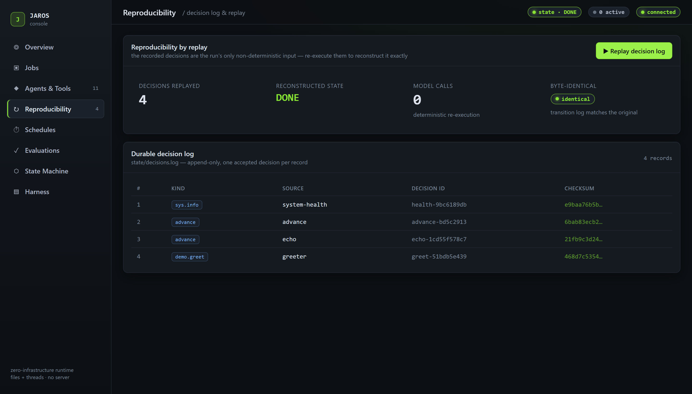

```bash
jaros replay --json    # { decisions, modelCalls:0, byteIdentical, ok }
```

## Schedules

Run jobs on a native cron, fixed interval, or one-shot — no external scheduler.
Create, pause, and delete schedules; the daemon dispatches them and they are
crash-safe (a restart neither double-fires nor skips).

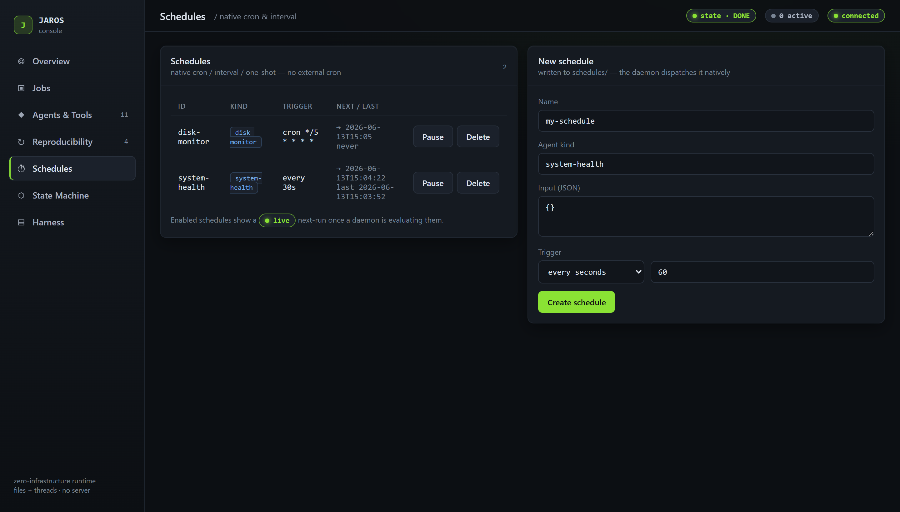

## Evaluations

Reproducible, declarative agent tests: input → expected decision/result, with no
model-grading flakiness. Run the suite and see per-case checks. Exit code is 0
iff all pass, so the same suite gates CI.

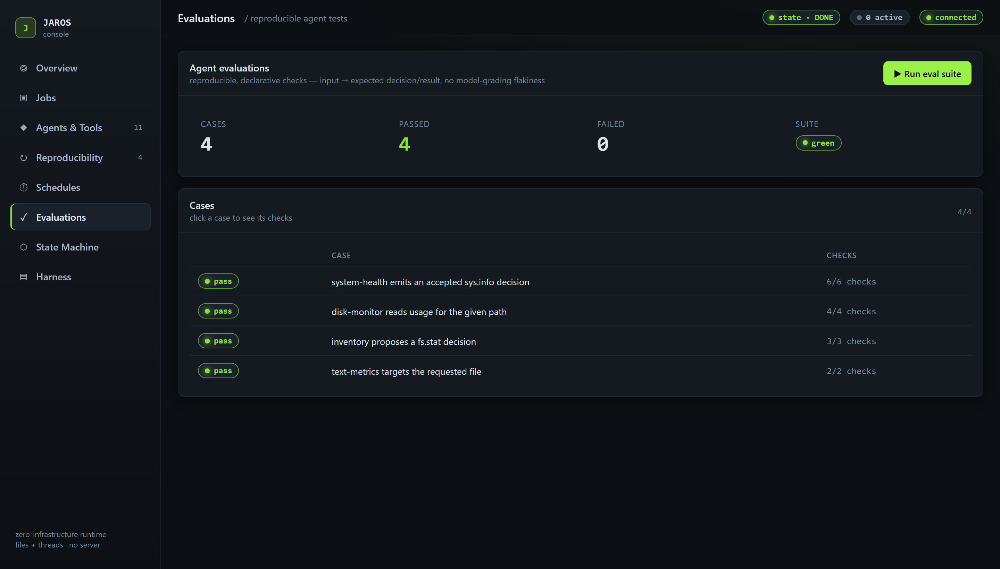

```bash
jaros eval        # exit 0 iff all pass
```

## State Machine

The single source of truth, introspected straight from `jaros` (not a hard-coded
copy). Only declared transitions are permitted; the durable, checksummed
`transitions.log` records every committed transition — and is exactly what
replay rebuilds.

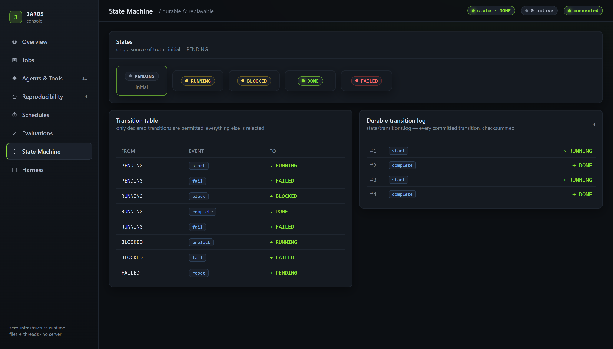

## Harness

Capability-safety, made visible. Agents hold only the scoped capabilities the
harness grants; every mediated action is default-deny. Shows the mediation rules
(action → required capability), the role → capability matrix, and the refusal
audit of contained failures.

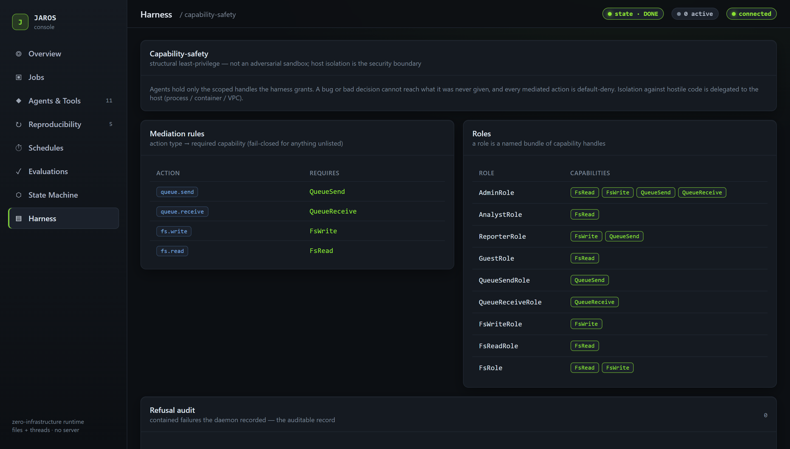

## See also

- [Getting started](getting-started.md) — day one to production, every command tested
- [Building agents](building-agents.md) — write your own agent and custom tool
- [Agent playbook](agent-playbook.md) — patterns and recipes
- [console README](../console/README.md) — architecture of the bridge + SPA
