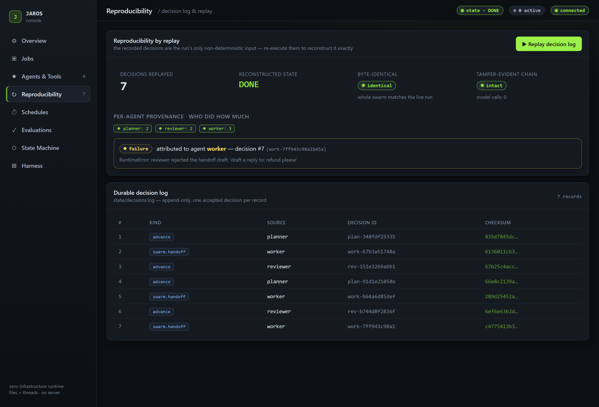
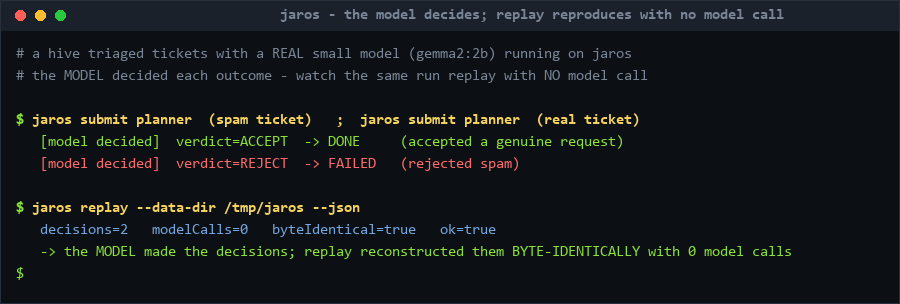

# What sets Jaros apart

Most agent frameworks let the model drive: a tool call *is* a side effect. That's
fine for a demo and a liability in production. Jaros inverts it — the model writes
recommendations on slips of paper; a deterministic clerk decides what actually
happens. These properties fall out of that design, and they're the whole point.

## 🐝 Reproducible & accountable swarms

The field is moving from one super-agent to **swarms of many small, specialized
agents** — and at that scale two failures dominate: you can't **reproduce** what
the swarm did, and you can't say **which agent caused it**. Jaros solves both by
construction. Every accepted `Decision` is recorded — in one ordered,
**hash-chained** log, **tagged with its source agent** — so replaying the log
re-executes the *whole hive* to **byte-identical state with zero model calls**, and
any failure is **attributed to the exact agent and decision** that produced it. A
single agent is just the swarm of one.

One command replays a hive and names the culprit; the console shows the same
per-agent breakdown and attribution beside the durable decision log:

And the agents really **let the model decide**: the LLM's verdict drives the
decision's outcome (accept → `DONE`, reject → `FAILED`), yet replay reconstructs
whatever the model chose with **zero model calls** — the model decides *what*, the
deterministic executor does *how*:

Run it yourself: [`examples/swarm/`](../examples/swarm/) (a support-triage hive
whose planner/worker/reviewer decisions are model-driven, with a seeded bad
handoff) and `python tests/integration/run_swarm_replay_demo.py` (the same,
end-to-end in Docker). Realized by [EXT-015](../.jarify/EXT-015/requirements.md).

## 🔁 Reproducible by replay

The only non-determinism in a run is the model's output, captured as inert
`Decision` data and recorded to a durable log **before** any effect is observable.
Replaying that log through the deterministic executor reconstructs the run to
**byte-identical state — with no model call.** Crash recovery is just a special
case of replay.

That means a misbehaving agent run is debuggable like any other software: **pin the
decision log, replay, reproduce, fix, re-run identically.** No "it only happens
sometimes."

The guarantee rests on one precondition — **executor handlers must be
deterministic** functions of the decision and state — and Jaros doesn't just assume
it: replay runs twice into isolated state and **flags any non-deterministic
handler** (the console shows `deterministic` next to `byte-identical`;
`jaros.execution.replays_agree` checks it in CI). Non-determinism that belongs in a
run — a clock read, a random choice, external I/O — goes *outside* the handler or is
captured as a decision, which is itself recorded and replayed.

In the [web console](../console/) it's one click — browse the durable decision log
and replay it, with the reconstructed state, the model-call count, and a
byte-identical check shown inline:

## 🔒 Capability-safe by construction

Agents hold only the scoped handles the harness grants them — no ambient access to
the file system, queues, or network. A bug or a bad decision **cannot reach what it
was never given**, and every mediated action leaves an auditable record. This is
structural least-privilege for blast-radius control (host-level isolation against
hostile code stays the host's job — process, container, VPC).

The console makes that legible — the mediation rules, the role→capability bundles,
and the refusal/failure audit, all in one view:

## 📦 Zero-infrastructure

No server, no database, no broker. The whole control plane is the local/shared file
system; agents are threads in one process. It runs anywhere files work, and a
`check_zero_infra` guardrail fails the build if any code so much as imports a
database driver or message broker.

## The graduation layer

Jaros sits between a prototype (LangGraph, CrewAI) and heavyweight
durable-execution infrastructure (Temporal, Dapr):

| | Prototype frameworks | **Jaros** | Durable-execution infra |
| --- | --- | --- | --- |
| Stand-up cost | none | **none** — files + threads | servers, brokers, databases |
| Reproducibility | best-effort | **record-and-replay to byte-identical state** | workflow replay (heavy) |
| Safety model | ambient tool access | **capability-scoped, default-deny** | varies |
| Model coupling | often hard-wired | **one interface, config swap** | varies |
| Distribution | single process | **single-node-first, bounded multi-node over the FS** | cluster-scale |
| Reach for it… | the first ten lines | **the day you ship** | large orgs at cluster scale |

It is deliberately **not**: a hardened security sandbox, a cluster-scale distributed
system, an agent-authorization/governance gateway, a hello-world prototyping
framework, or "unbreakable." It claims only what the architecture delivers —
durable, crash-recoverable, replayable, and capability-bounded. (See the
[Prime Directive](../.jarify/PRIME-001/intent.md) for the full "is / is not.")

## Why agent builders use it

- **Ship runs you can reproduce.** The decision log turns a flaky prod incident into
  a deterministic replay you can step through.
- **Contain the blast radius.** Least-privilege handles mean a misbehaving agent
  touches only what you granted it — and you can audit every action.
- **Stand up nothing.** No infra to provision; `pip install` and run, or one Docker
  container per node.
- **Swap models freely.** The LLM lives behind one `LlmClient` interface; change
  provider/model by config, with zero harness changes.
- **Extend at runtime.** Drop an agent into `agents/` or a custom tool into `tools/`
  and the daemon loads it on the next tick — no restart, no core edits.
